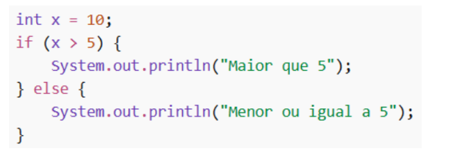
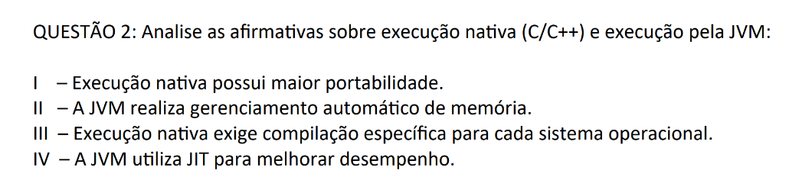
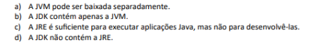
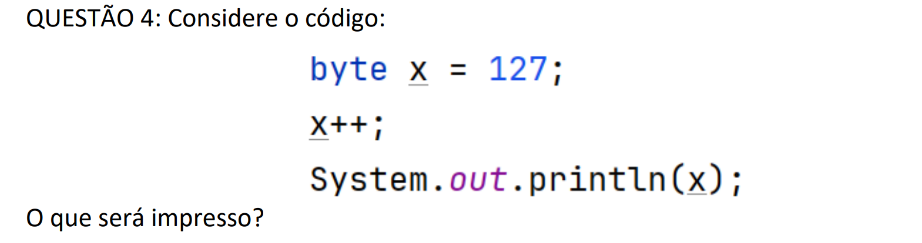
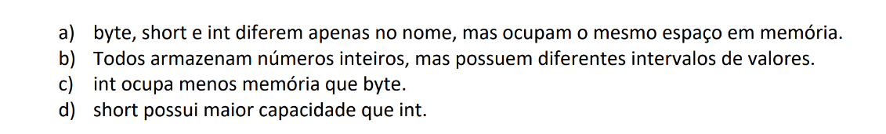
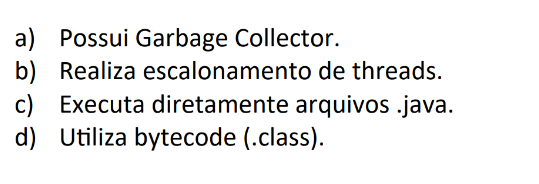
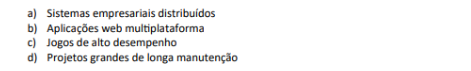

>Autor : Rafael Bruno Domingos
---
#### QUESTÃO 1 

 

a) Qual será a saída do programa?  

Resposta: **Maior que 5**.  

b) Explique o papel da estrutura condicional no controle de fluxo.  

Resposta: Garantir se o numero é maior ou menor que 5.  

---
#### QUESTÃO 2

 

Resposta: b)Apenas II, III e IV estão corretas.  

---
#### QUESTÃO 3

 

Resposta: c) A JRE é suficiente para executar aplicações Java, mas não para desenvolvê-las

---
#### QUESTÃO 4

 

Resposta: b) -128.  

---
#### QUESTÃO 5

 

Resposta: b) Todos armazenam números inteiros, mas possuem diferentes intervalos de valores.

---
#### QUESTÃO 6

 

Resposta: c) Executa diretamente arquivos .java.  

---

#### QUESTÃO 7

 

Resposta: c) Jogos de alto desempenho

---
#### QUESTÃO 8

 

Resposta: Sim, o Java é uma linguagem compilada, mas também é interpretada  

---
#### QUESTÃO 9

 

Resposta: 

A **JRE** é o ambiente necessário para **rodar** aplicações Java. 

O **JDK** é um kit completo para **desenvolvedores**. O que significa que tudo o que está na JRE também está dentro do JDK, mas com ferramentas extras.

---
#### QUESTÃO 10

[Ir para a Atividade 10](/Exercicio_1/Atividade_10/src/Main.java)
