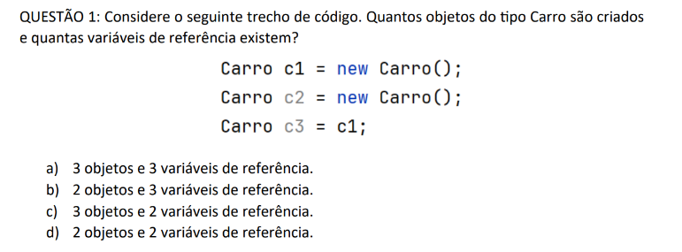
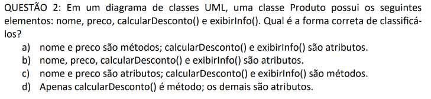
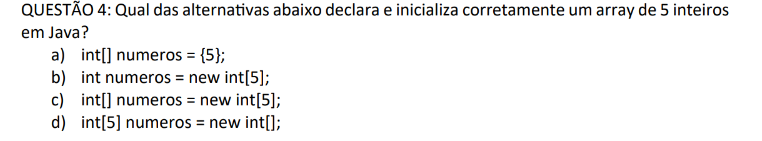
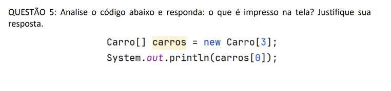
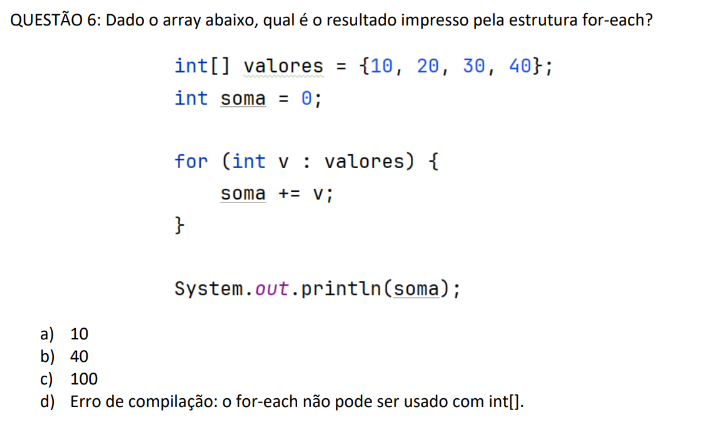
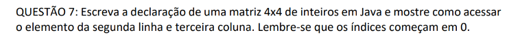
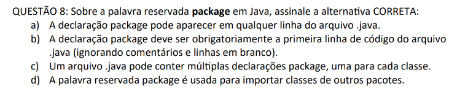
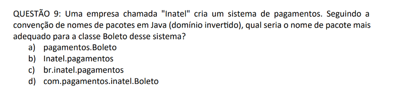

# Atividade 2
---
>Autor : Rafael Bruno Domingos
---

#### QUESTÃO 1

 

Resposta: b) 2 objetos e 3 variáveis de referência.

---

 

Resposta: c) nome e preco são atributos; calcularDesconto() e exibirInfo() são métodos.

---

 

Resposta: c) int[] numeros = new int[5];

---

 

Resposta: O que será impresso na tela é: **`null`**

---

 

Resposta: c) 100

---

 

Respotas: 

---

 

Resposta: b) A declaração package deve ser obrigatoriamente a primeira linha de código do arquivo .java (ignorando comentários e linhas em branco).

---

 

resposta: c) br.inatel.pagamentos.

---
[Ir para a Atividade 10](Atividade_10/src/br/inatel/poo/turmar/Main.java)
